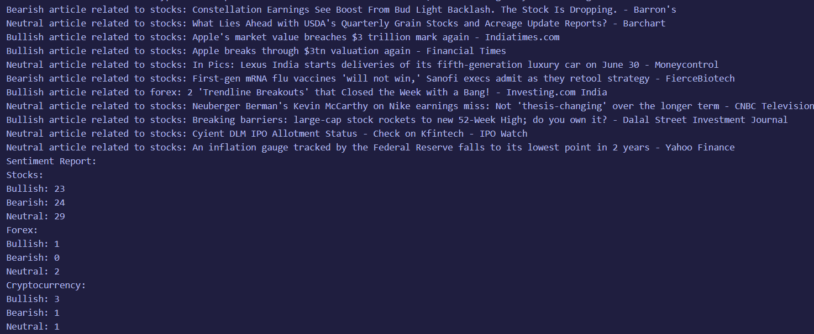

# Finance News Crawler
[](https://code.visualstudio.com/)
[](https://github.com/xojs/xo)
[](https://github.com/simwai/finance-news-crawler/actions/workflows/qodana.yml)
[](https://github.com/simwai/finance-news-crawler/actions/workflows/codeql.yml)
[](https://opensource.org/licenses/MIT)

The Finance News Crawler is a powerful tool that allows you to crawl finance news articles, perform sentiment analysis using OpenAI GPT, and generate a sentiment report for crypto, stocks, and forex markets.

<i>50 % made ChatGPT</i>



## Features

- Crawls finance news articles from the web
- Performs sentiment analysis using OpenAI GPT API
- Generates a sentiment report for crypto, stocks, and forex markets

## Getting Started

Follow the steps below to set up the Finance News Crawler project from scratch.

### Prerequisites

- Node.js 16.17.0
- News API key (sign up at [newsapi.org](https://newsapi.org) to obtain an API key)
- OpenAI API key (sign up at [openai.com](https://openai.com) to obtain an API key)

### Installation

1. Clone the repository:

   ```bash
   git clone https://github.com/simwai/finance-news-crawler.git
   ```

2. Install the dependencies:

   ```bash
   cd finance-news-crawler
   npm install
   ```

3. Set up your API keys:

   - Rename `config.json.example` to `config.json`
   - Enter the NEWS_API_KEY
   - Enter the OPENAI_API_KEY
   - Choose 'openai' or 'vader' as SENTIMENT_ANALYSIS_ALGORITHM 
   </br><i>VADER (Valence Aware Dictionary and sEntiment Reasoner) is a lexicon and rule-based sentiment analysis tool that is specifically attuned to sentiments expressed in social media.</i>

1. Run the project:

   ```bash
   npm run-script run
   ```

2. Wait for the Finance News Crawler to crawl the news articles and perform sentiment analysis.
3. Once the process is complete, the sentiment report will be displayed in the console.

## Customization

You can customize the Finance News Crawler according to your needs:

- Modify the crawling parameters in the `crawlFinanceNews` function to fetch news articles from different sources or with different criteria.
- Adjust the sentiment analysis settings in the OpenAI GPT API request to fine-tune the sentiment analysis process.
- Update the sentiment report format in the `crawlFinanceNews` function to match your desired output structure.

## Contributing

Contributions are welcome! If you find any issues or have suggestions for improvements, please feel free to open an issue or submit a pull request.

## License

This project is licensed under the [MIT License](LICENSE).
